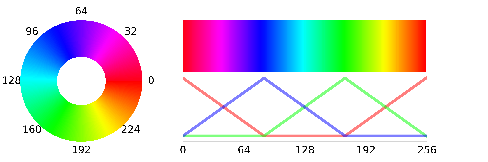
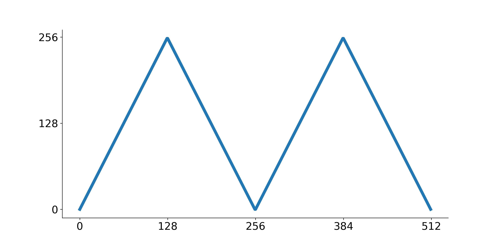
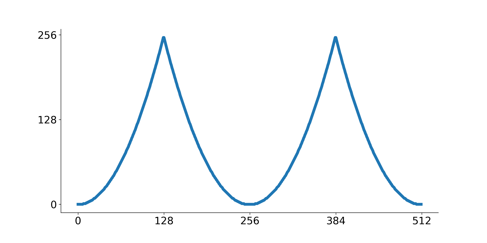

<div class="flex-container"><div class="wide-text">
# The SpinWheel firmware v0.0.1
This code is at the heart of all of our educational materials. It is what
lets you write short programs of just a few lines and still make wonderful and
beautiful patterns. If you have only recently started programming this code
might look somewhat intimidating, hence consider starting with something
simpler before delving in this much deeper pond.
</div>
<div class="side-text">
</div>
<div class="code">
```cpp

```
</div>
<div class="side-text">
## Libraries
First we need to include a number of tools that are already provided
by other people and that will simplify our work quite a bit. Such tools
are usually called "software libraries".
</div>
<div class="code placeholder">
</div>
<div class="side-text">
The `NeoPixel` library from Adafruit provides the functions we will use to
talk to the large LEDs.
</div>
<div class="code">
```cpp
#include "Adafruit_NeoPixel.h"
```
</div>
<div class="side-text">
The `ICM_20948` library from Sparkfun provides the functions to talk to the
motion sensor.
</div>
<div class="code">
```cpp
#include "ICM_20948.h"
```
</div>
<div class="side-text">
And the `math` standard library gives us access to frequently used
mathematical functions (e.g. trigonometrics and exponents).
</div>
<div class="code">
```cpp
#include <math.h>

```
</div>
<div class="side-text">
Here the implementation of our own new library starts. We will call it
`SpinWearables`, after the name of our volunteer organization.
</div>
<div class="code">
```cpp
namespace SpinWearables {

```
</div>
<div class="side-text">
## Constants

We will define a couple of convenient constants that will be used throughout
our code.
</div>
<div class="code placeholder">
</div>
<div class="side-text">
In many parts of the code we use a `byte` to represent a position on a
circle. One byte can contain any number between 0 and 255. Given that we have
12 small LEDs, we would frequently want to know what one 12th of 255 is, i.e.
$\left\lfloor\frac{255}{12}\right\rfloor=21$, hence we put it here as a
easy-to-reuse constant.
</div>
<div class="code">
```cpp
#define ONETWELFTH 21
```
</div>
<div class="side-text">
The maximum number of animation routines the firmware permits (an arbitrary
limit, simply ensuring we do not reserve too much memory). See
`addAnimationRoutine` for details.
</div>
<div class="code">
```cpp
#define MAXROUTINES 10
```
</div>
<div class="side-text">
A parameter related to how many times we repeat a frame on the small LEDs.
This is the main source of delay in our code. See `drawSmallLEDFrame`.
</div>
<div class="code">
```cpp
#define SMALLLEDTIMEDIV 1
```
</div>
<div class="side-text">
Parameters for the smoothing filters we use in order to make the readings of
the motion sensor less jittery.
</div>
<div class="code">
```cpp
#define FILTER_DIV 8
#define FILTER_A 64
#define FILTER_B ((1<<FILTER_DIV) - FILTER_A)

```
</div>
<div class="side-text">
## Profiling functions
We use this function to measure how fast our code is. When you run it, it
tells you how many milliseconds have passes since the previous time it was
invoked.
</div>
<div class="code">
```cpp
long executionTime() {
  static long t = millis();
  long r = millis()-t;
  t = millis();
}

long executionTimeMicros() {
  static long t = micros();
  long r = micros()-t;
  t = micros();
  return r;
}

```
</div>
<div class="side-text">
## Drawing convenience functions
We have prepared a number of convenience functions to make drawing animations simpler.
</div>
<div class="code placeholder">
</div>
<div class="side-text">
#### Color encoding
Some of our code expects the value of a color to be provided as a 32-bit
word of which the bottom 24 bits (3 bytes) contain information about the red,
green, and blue components of the color. This function lets us turn 3 bytes,
one for each component into a single 32-bit word.
</div>
<div class="code">
```cpp
uint32_t color(uint8_t r, uint8_t g, uint8_t b) {
  return (((uint32_t)r)<<16)+(((uint32_t)g)<<8)+b;  
}

```
</div>
<div class="side-text">
#### Color wheel
Frequently one needs to access the color (or hue) wheel. It is particularly
important when making rainbows for instance. This function takes a coordinate
on the circle (a single byte, 0 to 255, where 255 denotes a whole turn), and
turns it into the corresponding hue.

</div>
<div class="code">
```cpp
uint32_t colorWheel(uint8_t wheelPos) {
  wheelPos = 255 - wheelPos;
  if(wheelPos < 85) {
    return color(255 - wheelPos * 3, 0, wheelPos * 3);
  }
  if(wheelPos < 170) {
    wheelPos -= 85;
    return color(0, wheelPos * 3, 255 - wheelPos * 3);
  }
  wheelPos -= 170;
  return color(wheelPos * 3, 255 - wheelPos * 3, 0);
}

```
</div>
<div class="side-text">
#### Triangular wave
This function takes a number between 0 and 255 and provides a periodic
triangular pattern, particularly useful when one needs a pulsing brightness.

</div>
<div class="code">
```cpp
uint8_t triangularWave(uint8_t x) {
  if (x>0x7f) {
    return (0xff-x)<<1;
  } else {
    return x<<1;
  }
}

```
</div>
<div class="side-text">
#### Parabolic wave
Similarly to the triangular wave, this function is useful for periodically
pulsating patterns. However, the profile of this function resembles a beating
heart more closely and it can provide for more pleasing visuals.

</div>
<div class="code">
```cpp
uint8_t parabolaWave(uint8_t x) {
  uint8_t xm = x;
  if (xm>0x7f) {xm = 0xff-xm;}
  return (xm*xm)>>6;
}

```
</div>
<div class="side-text">
## Smoothing functions
With these tools various measurements can be made smoother, for more
easthetically pleasing look.
</div>
<div class="code placeholder">
</div>
<div class="side-text">
#### Fast-on slow-off filter
Using this function you can very rapidly respond to a new non-zero
measurement, but then slowly  decay back to zero if the signal ends.
</div>
<div class="code">
```cpp
float faston_slowoff(float filtered_intensity, float current_intensity, float decay) {
  if (current_intensity > filtered_intensity) {
      return current_intensity;
  } else {
      return decay*current_intensity + (1-decay)*filtered_intensity;
  }
}

```
</div>
<div class="side-text">
## Forward declarations
Occasionally we need to use a function in the definition of another function, before we have had a chance to properly implement the first function. We list these functions here, in what is called a "forward declaration", in order to tell the computer to reserve space for them.
</div>
<div class="code">
```cpp
void cycleAnimationRoutine();

```
</div>
<div class="side-text">
## The main `SpinWheel` class.
In the following "class" we encapsulate all of the functionality that works
directly with the SpinWheel hardware.
</div>
<div class="code">
```cpp
class SpinWheelClass {
  public:
```
</div>
<div class="side-text">
### The constructor
This is the "constructor" for our `SpinWheel` object. It ensure that any
prerequisite objects are created before we initialize the main object.
</div>
<div class="code">
```cpp
    SpinWheelClass() {
      largeLEDs = Adafruit_NeoPixel(8, 15, NEO_GRB + NEO_KHZ800); // XXX HARDWARE DETAIL: 8 LEDs on pin d15.
    };

```
</div>
<div class="side-text">
### The hardware initialization function
The `begin` function is called when we are ready to start talking to all of the SpinWheel hardware, usually in `setup()`.
</div>
<div class="code">
```cpp
    void begin(bool button=true) {
```
</div>
<div class="side-text">
Initialize all of the pins we use to drive the grid of small LEDs.
</div>
<div class="code">
```cpp
      PORTB &= B00000011;
      PORTD |= B11111100;
      DDRB |= B11111100;
      DDRD |= B11111100;
```
</div>
<div class="side-text">
Ensure that the large LEDs, controlled by the Adafruit NeoPixel library are also ready.
</div>
<div class="code">
```cpp
      largeLEDs.begin(); 
      largeLEDs.show();
```
</div>
<div class="side-text">
Prepare the hardware necessary for talking to the motion sensor.
</div>
<div class="code">
```cpp
      Wire.begin();
      Wire.setClock(400000);
      IMU.begin(Wire, 1); // XXX HARDWARE DETAIL; AD0 is pulled.
      // TODO check that the IMU works.
```
</div>
<div class="side-text">
If instructed, ensure that the button press is set to run a small routine
that changes the current animation.
</div>
<div class="code">
```cpp
      if (button) {
        digitalWrite(7, INPUT_PULLUP); // XXX HARDWARE DETAIL: Pin D7 is connected to the button.
        attachInterrupt(digitalPinToInterrupt(7), cycleAnimationRoutine, FALLING);
      }
      clearAllLEDs();
      drawFrame();
    }

```
</div>
<div class="side-text">
### We store the current state of the LEDs in these objects.
</div>
<div class="code">
```cpp
    uint8_t smallLEDs[36];
    Adafruit_NeoPixel largeLEDs;
    
```
</div>
<div class="side-text">
### We store various motion sensor readings in these variables.
</div>
<div class="code">
```cpp
    ICM_20948_I2C IMU;
    float ax, ay, az, gx, gy, gz, mx, my, mz;
    int8_t ax_int, ay_int, az_int, gx_int, gy_int, gz_int, mx_int, my_int, mz_int;
    int32_t taxsmooth, taysmooth, tazsmooth, tgxsmooth, tgysmooth, tgzsmooth, tmxsmooth, tmysmooth, tmzsmooth;

```
</div>
<div class="side-text">
### And the list of animations and the currently running animation is stored here.
</div>
<div class="code">
```cpp
    void (*animationroutines[MAXROUTINES]) (void);
    size_t current_animation = 0;
    size_t registered_animations = 0;
    
```
</div>
<div class="side-text">
### The functions pushing the current frame to the LEDs.
It does so by running two subroutines, one for each set of LEDs.
</div>
<div class="code">
```cpp
    void drawFrame() {
      drawSmallLEDFrame();
      drawLargeLEDFrame();
    }

```
</div>
<div class="side-text">
The same function can be called with a timeout, ensuring that the hardware
repeatedly redraws the image, and does nothing else for the duration of the
timeout.
</div>
<div class="code">
```cpp
    void drawFrame(unsigned long timeout) {
      unsigned long t = millis();
      drawLargeLEDFrame();
      while(millis()-t<timeout) {drawSmallLEDFrame();}
    }

```
</div>
<div class="side-text">
#### The drawing function responsible for the small LEDs.
This function employs persistence of vision: only a few LEDs flash at the
same time, but in a rapid succession we loop through all of them, ensuring that
to the human eye all of them seem on. We modulate the intensity of each
color by turning it on for different durations.
</div>
<div class="code">
```cpp
    void drawSmallLEDFrame() { // XXX HARDWARE DETAIL: B2-B7 and D2-D7 make up the small LEDs grid.
```
</div>
<div class="side-text">
This loop specifies how many time we cycle through each LED before we exit
the functions. We want to do it more times in order to have more vivid colors,
but not too many times as to have this function take too long.
</div>
<div class="code">
```cpp
      for(int frame=0; frame<2<<SMALLLEDTIMEDIV; frame++) { // XXX: 2 repetitions lead to drawSmallLEDFrame taking 0.021 seconds.
```
</div>
<div class="side-text">
And the following two loops go through each row and column of the small LED
grid in order to address them efficiently.
</div>
<div class="code">
```cpp
        for(int i=0; i<6; i++) {
          PORTB &= B00000011;
          PORTB |= B00000100 << i;
          for(int j=0; j<6; j++) {
            uint8_t d = smallLEDs[i*6+j];
```
</div>
<div class="side-text">
On the delays in this inner loop depends how bright the color will be. A
longer delay during for a turned-on LED implies a brighter color.
</div>
<div class="code">
```cpp
            if (d) {
              PORTD ^= B00000100 << j;
              delayMicroseconds(d>>SMALLLEDTIMEDIV);
              PORTD |= B11111100;
            }
            delayMicroseconds((255-d)>>SMALLLEDTIMEDIV);
          }
        }
      }
    }

```
</div>
<div class="side-text">
#### The drawing function for the large LEDs
It simply calls into the Adafruit NeoPixel library.
</div>
<div class="code">
```cpp
    void drawLargeLEDFrame() {
      largeLEDs.show();  
    }

```
</div>
<div class="side-text">
### Talking to the motion sensor
</div>
<div class="code">
```cpp
    void readIMU() {
```
</div>
<div class="side-text">
Check that the sensor is ready, and read the current acceleration (A),
rotation (G for gyroscope), magnetism (M), and temperature (T) data.
</div>
<div class="code">
```cpp
      if( IMU.dataReady() ){
        IMU.getAGMT();
```
</div>
<div class="side-text">
First smooth out the measurements using an exponential averaging filter.
Each new value is used to slowly update the filtered value, through the formula
$$x_\text{filtered}=\alpha\times x_\text{newest reading} + (1-\alpha)\times
x_\text{old value},$$ where $\alpha$ is between 0 and 1. If $\alpha$ is large we
rapidly follow the sensor readings, but if it is small, only a smooth filtered
signal is preserved.
</div>
<div class="code">
```cpp
        taxsmooth = (((int32_t)IMU.agmt.acc.axes.x)*FILTER_A + taxsmooth*FILTER_B)>>FILTER_DIV;
        taysmooth = (((int32_t)IMU.agmt.acc.axes.y)*FILTER_A + taysmooth*FILTER_B)>>FILTER_DIV;
        tazsmooth = (((int32_t)IMU.agmt.acc.axes.z)*FILTER_A + tazsmooth*FILTER_B)>>FILTER_DIV;
        tgxsmooth = (((int32_t)IMU.agmt.gyr.axes.x)*FILTER_A + tgxsmooth*FILTER_B)>>FILTER_DIV;
        tgysmooth = (((int32_t)IMU.agmt.gyr.axes.y)*FILTER_A + tgysmooth*FILTER_B)>>FILTER_DIV;
        tgzsmooth = (((int32_t)IMU.agmt.gyr.axes.z)*FILTER_A + tgzsmooth*FILTER_B)>>FILTER_DIV;
        tmxsmooth = (((int32_t)IMU.agmt.mag.axes.x)*FILTER_A + tmxsmooth*FILTER_B)>>FILTER_DIV;
        tmysmooth = (((int32_t)IMU.agmt.mag.axes.y)*FILTER_A + tmysmooth*FILTER_B)>>FILTER_DIV;
        tmzsmooth = (((int32_t)IMU.agmt.mag.axes.z)*FILTER_A + tmzsmooth*FILTER_B)>>FILTER_DIV;
        ax_int = taxsmooth>>8;
        ay_int = taysmooth>>8;
        az_int = tazsmooth>>8;
        gx_int = tgxsmooth>>8;
        gy_int = -tgysmooth>>8;
        gz_int = -tgzsmooth>>8;
        mx_int = tmxsmooth>>3;
        my_int = -tmysmooth>>3;
        mz_int = -tmzsmooth>>3;
        ax = taxsmooth / 16384.;
        ay = taysmooth / 16384.;
        az = tazsmooth / 16384.;
        gx = tgxsmooth / 16384.;
        gy = tgysmooth / 16384.;
        gz = tgzsmooth / 16384.;
        mx = tmxsmooth / 16384.;
        my = tmysmooth / 16384.;
        mz = tmzsmooth / 16384.;
	
      }
    }

```
</div>
<div class="side-text">
### Animation routines
</div>
<div class="code">
```cpp
    void runAnimationRoutine() {
      if (registered_animations && current_animation < registered_animations && animationroutines[current_animation]!=0) {
        animationroutines[current_animation]();
      }
    }

    void addAnimationRoutine(void (*routine) (void)) {
      if (registered_animations<MAXROUTINES) {
        animationroutines[registered_animations] = routine;
        registered_animations++;
      }
    }

```
</div>
<div class="side-text">
### All of the functions used to draw to the upcoming frame
</div>
<div class="code">
```cpp
    void setSmallLEDsRainbow(uint8_t angle) {
      for (int i=0; i<12; i++) {
        setSmallLED(i, colorWheel(angle+i*ONETWELFTH));
      }
    }
    
    void setSmallLED(int i, uint8_t r, uint8_t g, uint8_t b) {
      smallLEDs[i*3] = r;
      smallLEDs[i*3+1] = g;
      smallLEDs[i*3+2] = b;  
    }
    
    void setSmallLED(int i, uint32_t rgb) {
      smallLEDs[i*3] = rgb>>16;
      smallLEDs[i*3+1] = rgb>>8;
      smallLEDs[i*3+2] = rgb;  
    }

    void setSmallLEDs(int i, int j, uint8_t r, uint8_t g, uint8_t b) {
      for (int ii=max(0,i); ii<min(12,j); ii++) setSmallLED(ii,r,g,b);
    }

    void setSmallLEDs(int i, int j, uint32_t rgb) {
      for (int ii=max(0,i); ii<min(12,j); ii++) setSmallLED(ii,rgb);
    }
    
    void setSmallLEDsUniform(uint8_t r, uint8_t g, uint8_t b) {
      for (int i=0; i<12; i++) {
        smallLEDs[i*3] = r;
        smallLEDs[i*3+1] = g;
        smallLEDs[i*3+2] = b;  
      }
    }
    
    void setSmallLEDsUniform(uint32_t rgb) {
      for (int i=0; i<12; i++) {
        smallLEDs[i*3] = rgb>>16;
        smallLEDs[i*3+1] = rgb>>8;
        smallLEDs[i*3+2] = rgb;
      }
    }

    void setLargeLED(int i, uint8_t r, uint8_t g, uint8_t b) {
      largeLEDs.setPixelColor(i,r,g,b);
    }
    
    void setLargeLED(int i, uint32_t rgb) {
      largeLEDs.setPixelColor(i,rgb);
    }
    
    void setLargeLEDsUniform(uint8_t r, uint8_t g, uint8_t b) {
      largeLEDs.fill(color(r,g,b), 0, 8);
    }
    
    void setLargeLEDsUniform(uint32_t rgb) {
      largeLEDs.fill(rgb, 0, 8);
    }

    void clearSmallLEDs() {
      setSmallLEDsUniform(0);  
    }

    void clearLargeLEDs() {
      largeLEDs.fill(0, 0, 8);
    }

    void clearAllLEDs() {
      setSmallLEDsUniform(0);  
      setLargeLEDsUniform(0);      
    }

```
</div>
<div class="side-text">
### Some slightly more advanced drawing functions
</div>
<div class="code">
```cpp
    void setSmallLEDsPointer(uint8_t angle, int64_t decay, uint8_t r, uint8_t g, uint8_t b) {
      for (int i=0; i<12; i++) {
        uint8_t rel = angle-i*ONETWELFTH;
        if (rel>=128) rel = 255-rel;
        uint32_t arel = max(255-rel*decay*2l/255,0);
        uint8_t tr = r*arel/255;
        uint8_t tg = g*arel/255;
        uint8_t tb = b*arel/255;
        setSmallLED(i,tr,tg,tb);
      }
    }
    
    void setSmallLEDsPointer(uint8_t angle, int64_t decay, uint32_t rgb) {
      setSmallLEDsPointer(angle, decay, rgb>>16, rgb>>8, rgb);
    }
    
    void setSmallLEDsProgress(uint8_t angle, uint8_t r, uint8_t g, uint8_t b) {
      int i;
      for (i=0; i<angle/ONETWELFTH; i++) {
        setSmallLED(i, r, g, b);
      }
      if (i==12) return;
      uint32_t br = angle%ONETWELFTH;
      setSmallLED(i, br*r/ONETWELFTH, br*g/ONETWELFTH, br*b/ONETWELFTH);
    }

    void setSmallLEDsProgress(uint8_t angle, uint32_t rgb) {
      setSmallLEDsProgress(angle, rgb>>16, rgb>>8, rgb);
    }
};

SpinWheelClass SpinWheel;

void cycleAnimationRoutine() { // called from interrupt
  static unsigned long last_interrupt_time = 0;
  unsigned long interrupt_time = millis();
  if (interrupt_time - last_interrupt_time > 200){
    SpinWheel.clearAllLEDs();
    SpinWheel.current_animation++;
    SpinWheel.current_animation %= SpinWheel.registered_animations;
  }
  last_interrupt_time = interrupt_time;
}

```
</div>
<div class="side-text">
## Preloaded animations
The SpinWheel comes with a number of preloaded animation routines.
</div>
<div class="code">
```cpp

void bootAnimation() {
  for (uint8_t i=0; i<252; i+=4) {
    SpinWheel.setSmallLEDsUniform(i,i,i);
    SpinWheel.drawFrame();
  }
  for (uint8_t i=252; i>0; i-=4) {
    SpinWheel.setSmallLEDsUniform(i,i,i);
    SpinWheel.drawFrame();
  }
  SpinWheel.clearSmallLEDs();
  for (uint8_t i=0; i<32; i++) {
    SpinWheel.setLargeLEDsUniform(i,i,i);
    SpinWheel.drawFrame();
  }
  for (uint8_t i=32; i>0; i--) {
    SpinWheel.setLargeLEDsUniform(i,i,i);
    SpinWheel.drawFrame();
  }
  SpinWheel.clearLargeLEDs();  
  SpinWheel.drawFrame();
}

```
</div>
<div class="side-text">
#### Rotating
A rotating pattern on the small LEDs.
<video src="./preloaded_rotating.mp4" muted="" autoplay="" playsinline="" loop=""></video>
</div>
<div class="code">
```cpp
void smallWhiteRotating() {
  uint8_t angle = (millis()>>4)&0xff;
  SpinWheel.setSmallLEDsPointer(angle, 500, 0xffffff);
}

```
</div>
<div class="side-text">
#### Breathing
A pulsing pattern on all of the LEDs.
</div>
<div class="code">
```cpp
void allBreathing() {
  uint8_t t = (millis()>>4)&0xff;
  uint8_t b1 = parabolaWave(t);
  uint8_t b2 = parabolaWave(t+20);
  uint8_t b3 = parabolaWave(t+70);
  uint8_t b4 = parabolaWave(t+90);
  for (int i=0; i<4; i++) {
    SpinWheel.largeLEDs.setPixelColor(i,b1,0,b1);
  }
  for (int i=4; i<8; i++) {
    SpinWheel.largeLEDs.setPixelColor(i,b2,0,b2);
  }
  for (int i=0; i<12; i++) {
    if (i%2==1) {
      SpinWheel.setSmallLED(i,b3,0,b3);
    } else {
      SpinWheel.setSmallLED(i,b4,0,b4);
    }
  }
}


```
</div>
<div class="side-text">
#### Tilt sensor 1
The large LEDs are used as a tilt sensor.
<video src="./preloaded_tilt.mp4" muted="" autoplay="" playsinline="" loop=""></video>
</div>
<div class="code">
```cpp
void tiltSensor() {
  int8_t x = SpinWheel.ax_int;  
  int8_t y = SpinWheel.ay_int;
  SpinWheel.clearLargeLEDs();
  if (x>0) SpinWheel.largeLEDs.setPixelColor(7,x,0,x);
  else SpinWheel.largeLEDs.setPixelColor(5,-x,0,-x);
  if (y>0) SpinWheel.largeLEDs.setPixelColor(4,y,0,y);
  else SpinWheel.largeLEDs.setPixelColor(6,-y,0,-y);
}

```
</div>
<div class="side-text">
#### Compass
A compass on the small LEDs, while the large LEDs are used as a tilt sensor.
</div>
<div class="code">
```cpp
void compass() {
  int8_t x = SpinWheel.ax_int;  
  int8_t y = SpinWheel.ay_int;
  SpinWheel.clearLargeLEDs();
  if (x>10) SpinWheel.largeLEDs.setPixelColor(7,x-8,0,0);
  else if (x<-10) SpinWheel.largeLEDs.setPixelColor(5,-x+8,0,0);
  else {
    SpinWheel.largeLEDs.setPixelColor(1,0,0,32-3*abs(x));
    SpinWheel.largeLEDs.setPixelColor(3,0,0,32-3*abs(x));
  }
  if (y>10) SpinWheel.largeLEDs.setPixelColor(4,y-8,0,0);
  else if (y<-10) SpinWheel.largeLEDs.setPixelColor(6,-y+8,0,0);
  else {
    SpinWheel.largeLEDs.setPixelColor(0,0,0,32-3*abs(y));
    SpinWheel.largeLEDs.setPixelColor(2,0,0,32-3*abs(y));
  }
  uint8_t angle = (atan2(SpinWheel.my_int, SpinWheel.mx_int)+3.1415/2)/2/3.1415*255;
  SpinWheel.setSmallLEDsPointer(angle, 500, 0xffffff);
}

```
</div>
<div class="side-text">
#### Tilt sensor 2
The small LEDs are used as a tilt sensor.
</div>
<div class="code">
```cpp
void tiltSensor2() {
  uint8_t angle = (atan2(SpinWheel.ay_int, SpinWheel.ax_int)+3.1415/2)/2/3.1415*255;
  SpinWheel.setSmallLEDsPointer(angle, 500, 0xffffff);
}

```
</div>
<div class="side-text">
#### Tilt sensor 3
Both the large and the small LEDs are used as a tilt sensor.
<video src="./preloaded_tilt3.mp4" muted="" autoplay="" playsinline="" loop=""></video>
</div>
<div class="code">
```cpp
void tiltSensor3() {
  int8_t x = SpinWheel.ax_int;  
  int8_t y = SpinWheel.ay_int;
  SpinWheel.setLargeLEDsUniform(0xffffff);
  if (x>10) {
    SpinWheel.largeLEDs.setPixelColor(7,x-8,0,x-8);
    SpinWheel.largeLEDs.setPixelColor(3,x-8,0,x-8);
  }
  else if (x<-10) {
    SpinWheel.largeLEDs.setPixelColor(5,-x+8,0,-x+8);
    SpinWheel.largeLEDs.setPixelColor(1,-x+8,0,-x+8);
  }
  if (y>10) {
    SpinWheel.largeLEDs.setPixelColor(4,y-8,0,y-8);
    SpinWheel.largeLEDs.setPixelColor(0,y-8,0,y-8);
  }
  else if (y<-10) {
    SpinWheel.largeLEDs.setPixelColor(6,-y+8,0,-y+8);
    SpinWheel.largeLEDs.setPixelColor(2,-y+8,0,-y+8);
  }
  uint8_t angle = (atan2(SpinWheel.ay_int, SpinWheel.ax_int)+3.1415/2)/2/3.1415*255;
  SpinWheel.setSmallLEDsPointer(angle, 500, 0xffffff);
}

```
</div>
<div class="side-text">
#### Flashlight
As the name suggests, this function turns all LEDs on to full brightness.
</div>
<div class="code">
```cpp
void flashlight() {
  SpinWheel.setSmallLEDsUniform(0xffffff);  
  SpinWheel.largeLEDs.fill(0xffffff, 0, 8);
}

```
</div>
<div class="side-text">
#### Large Rainbow
Draw a rainbow on the larger LEDs and while the smaller ones are all white.
<video src="./preloaded_rainbow.mp4" muted="" autoplay="" playsinline="" loop=""></video>
</div>
<div class="code">
```cpp
void largeRainbow() {
  long int angle = millis()/20;
  SpinWheel.setSmallLEDsUniform(0xffffff);
  for (int i=0; i<4; i++) {
    SpinWheel.setLargeLED(i, colorWheel(angle+i*255/4));
    SpinWheel.setLargeLED(7-i, colorWheel(angle+i*255/4));
  }


```
</div>
<div class="side-text">
</div>
<div class="code">
```cpp
}

} // end namespace SpinWearables

```
</div>
</div>